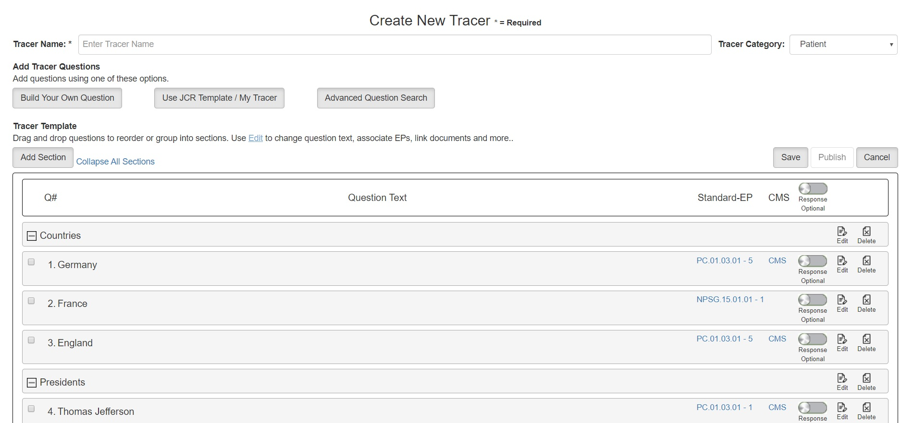
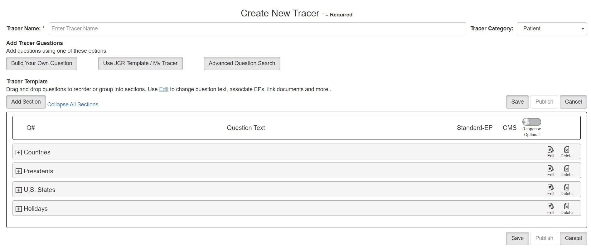
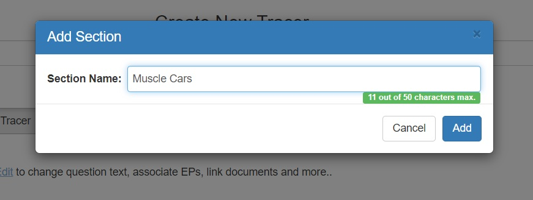

# DragDrop
JavaScript &amp; jQuery project developed as a proof-of-concept. This project show how to enable a web page so the customer can drag and drop questions to change their order within the form.

This first example shows what the page would look like when all the sections were expanded. I built-in the ability to contain questions within section. This allows the user to drag around sections (groups of questions). The user can expand a section and drag around questions within a section or drag questions into other sections.

Below you can see what the form looks like if you collapse all the sections. Notice there's a toggle on the form to let you expand or collapse all sections.

At the time, we were heavy into jQuery, so I wanted to try out jQuery modal forms as well.

